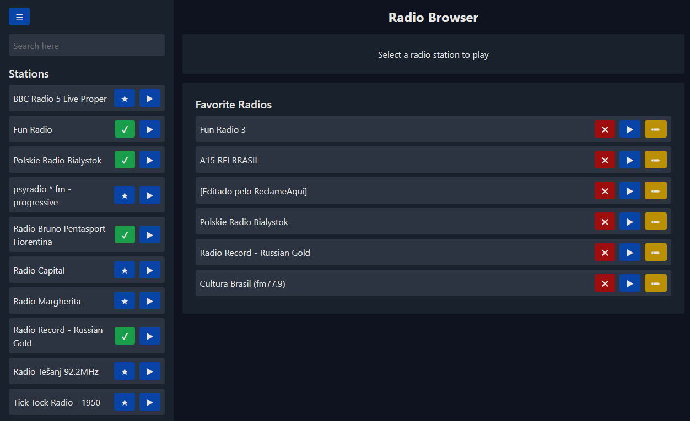
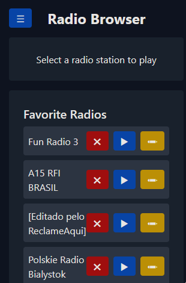

# Radio Browser App

Uma aplicação de streaming de rádio moderna para pesquisar, ouvir e gerenciar suas estações de rádio favoritas.

## 📝 Descrição

O Radio Browser App é um projeto de front-end que consome uma API REST e permite explorar, ouvir e gerenciar estações de rádio favoritas, proporcionando aos usuários a possibilidade de relembrar os tempos antigos, trazendo a rádio de volta através de uma plataforma moderna e acessível.

## 🚀 Tecnologias Usadas

- **Linguagem:** JavaScript (ES6+)
- **Framework/Biblioteca:** React.js
- **Gerenciamento de Estado:** useState (React Hooks)
- **Armazenamento:** Local Storage
- **Estilização:** Tailwind CSS

## 📦 Instalação e Uso

### Pré-requisitos

- Node.js instalado no seu sistema.

### Passos para Rodar o Projeto

1. Clone o repositório.
2. Instale as dependências com o comando `npm install`.
3. Inicie o servidor de desenvolvimento com o comando `npm start`.
4. O site deve abrir automaticamente, mas caso não abra, acesse http://localhost:3000 no seu navegador e estará rodando.

### Funcionalidades

- Pesquisar estações de rádio por nome, país ou tags.
- Adicionar suas estações favoritas à lista de favoritos para acesso rápido.
- Editar os detalhes das suas estações favoritas.
- Design responsivo para desktop e mobile.

### Pré-visualização

    
    

### Próximos passos

- [x] [Deploy na Vercel](https://frontend-radio-browser-pink.vercel.app/)
- [ ] Testes com Jest
- [ ] Dockerização

### Referência

> This is a challenge by [Coodesh](https://coodesh.com/)
